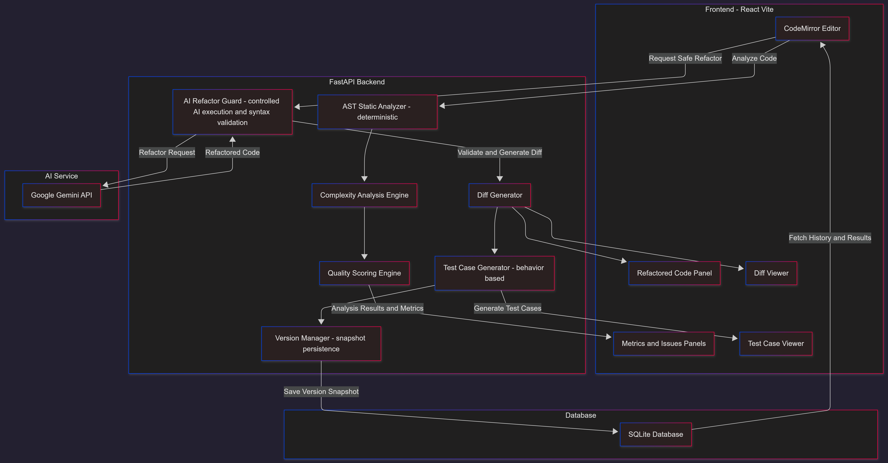

# CodeSage – Static Code Analysis & Refactoring Platform

> A safe, explainable, and developer-first AI code debugger that combines deterministic static analysis with controlled AI refactoring.

## 🌐 Live Demo

👉 **Live Application:** https://codesage-nine.vercel.app

Backend & API

- Backend API: https://codesage-backend-eg56.onrender.com
- Swagger Docs: https://codesage-backend-eg56.onrender.com/docs

CodeSage is a developer-focused platform that performs **static code analysis, complexity evaluation, quality scoring, AI-based refactoring, test case generation, and Git-like version tracking** — all within a single, unified workflow.

Unlike simple linters or AI-only refactor tools, **CodeSage blends rule-based analysis with AI assistance**, ensuring **accuracy, safety, and explainability** at every step.

---

## 🚀 What This Project Achieves

CodeSage helps developers:

- Detect code quality issues **before runtime**
- Understand **time and structural complexity**
- Improve **readability, maintainability, and documentation**
- Safely refactor code **without changing logic**
- Track code evolution using **Git-like version history**
- Generate **relevant test cases** based on real code behavior

All insights are presented through a **clean, developer-friendly UI** designed for clarity and productivity.

---

## 📸 Screenshots

### 🧪 Code Input

Shows the original buggy code before analysis.

---

### 🚨 Static Analysis & Issues

Detected code issues with severity and line numbers.

---

### 📊 Complexity & Quality Scores

Displays nesting depth, Big-O estimation, and quality metrics.

---

### 🔧 AI Refactored Code

Clean, logic-preserving refactored output generated by AI.

---

### 🔍 Unified Diff View

Side-by-side diff between original and refactored code.

---

### 🧪 Test Case Generation

Automatically generated test cases based on real code behavior.

---

### 🕒 Version History

Git-like version snapshots with issues, code, and diffs.

---

## 🧠 Core Capabilities

### 1️⃣ Static Code Analysis (AST-Based)

Performs deterministic analysis using Python’s AST to detect:

- Unused variables and imports
- Bad naming conventions
- Missing module & function docstrings
- Dead code and deep nesting
- Accurate **line-level issue reporting**

Issues are categorized as:

- **Error**
- **Warning**
- **Documentation**

**Technology:** Python AST traversal  
**Accuracy:** Deterministic (no AI hallucination)

---

### 2️⃣ Complexity Analysis Engine

Computes and reports:

- Nesting depth
- Loop depth (including nested & async loops)
- Estimated Big-O complexity (`O(1)` → `O(n²)`)

Detects patterns such as:

- Nested loops

Outputs a **normalized complexity score (0–100)** so developers instantly understand performance risks.

---

### 3️⃣ Quality Scoring System

Each code submission is evaluated across:

| Metric          | Description                    |
| --------------- | ------------------------------ |
| Readability     | Naming, clarity, structure     |
| Maintainability | Modularity & change resilience |
| Style           | Formatting & conventions       |
| Documentation   | Docstrings & explanation       |

- Scores are **weighted, realistic, and capped**
- Final score reflects **real developer expectations**, not arbitrary penalties

---

### 4️⃣ AI-Based Refactoring (Safe by Design)

Refactors code while **strictly preserving behavior**:

- Improves naming & structure
- Reduces nesting and duplication
- Adds meaningful docstrings
- Removes unused variables and dead assignments

Safety guarantees:

- Markdown fences are stripped
- Syntax validated using `compile()`
- Automatic rollback on invalid AI output

AI is used **only where safe and controlled**.

---

### 5️⃣ Diff Viewer

Provides a unified diff between:

- Original code
- Refactored code

Highlights:

- Added lines
- Removed lines
- Clear visual change tracking

This ensures **full transparency** in AI-generated modifications.

---

### 6️⃣ Git-Like Version History ⭐ (Unique Feature)

Every analysis or refactor can be saved as a **version snapshot**.

Each version stores:

- Code snapshot
- Detected issues
- Complexity metrics
- Quality score
- Diff summary

Supports:

- Viewing version details
- Deleting versions
- Clearing session history

This feature **differentiates CodeSage** from typical AI code tools.

---

### 7️⃣ Test Case Generation

Automatically generates test cases based on:

- Actual code behavior
- Refactored logic (preferred when available)

Guarantees:

- Structured, non-empty test output
- Realistic expected values
- Clear input-output mapping

---

## 🛡 UX & Stability Guarantees

- No analysis, refactor, or test generation runs on **empty input**
- No silent failures
- Clear user feedback on invalid actions
- Auto-scrolling to relevant sections (Issues, Refactor, Test Cases)
- Fully responsive **dark-mode UI**
- Graceful fallbacks on AI or backend errors

---

## 🧩 System Architecture

📷 High-resolution architecture diagram

---

## 🧩 Architecture Overview

### Frontend

- React (Vite)
- Tailwind CSS
- CodeMirror Editor
- Modular component architecture

### Backend

- FastAPI
- Python AST analysis
- SQLite (Version History)
- Google Gemini API

---

## 🌟 Why CodeSage Is Different

- Combines **deterministic static analysis + AI**, not AI alone
- AI output is **syntax-validated and rollback-safe**
- Version history works like **Git**, not chat history
- Designed for **real developers**, not just demos

---

## 🏗️ Tech Stack

**Frontend:** React, Vite, Tailwind CSS, CodeMirror  
**Backend:** FastAPI, Python AST, SQLite  
**AI:** Google Gemini  
**Persistence:** SQLite (version history)

---

## 👤 Author

**Kiruthika M**  
AI & DS Student | Aspiring Software Development Engineer

---

## 📌 Status

🚀 **Actively developed**  
🎯 Hackathon-ready  
💼 Resume-ready project
